<p align="center">
  
</p>

<div align="center">

<a href="https://git.io/typing-svg">
  
</a>

<br/><br/>

<p align="center">
  
  
  
  
  
  
  
</p>

</div>

---

## 🧠 About Me
 
```java
public class AdarshSahu {
 
    String   name      = "Adarsh Sahu";
    String   degree    = "B.Tech Data Science (2024-2028)";
    String   college   = "Baderia Global Institute of Engineering & Management";
    String[] roles     = { "Backend Engineer", "ML Engineer", "AI Integration Specialist" };
    String[] currently = { "Distributed Microservices", "AI-Driven Automation", "RAG Pipelines" };
    String[] mastering = { "Saga Pattern", "CQRS", "MLOps", "LLM Fine-tuning" };
 
    String motto() {
        return "Build systems that don't just work — build systems that SURVIVE. ⚡";
    }
} 
```
---
### ☕ Languages


 
### 🚀 Backend & Frameworks


 
### 🤖 AI / ML & Data Science


 
### ⚙️ Infrastructure & Databases


 

---

## 📌 Featured Projects

### 🔹 AI-Powered Fitness Tracking Platform
*Scalable microservices ecosystem providing personalized workout intelligence.*
- **Challenge:** Creating a dynamic, personalized experience for diverse user goals.
- **Solution:** Orchestrated **Microservices** using **Kafka** for event-driven logging and **Spring AI** for real-time recommendation generation.
- **Tech:** Java, Spring Boot, Spring AI, Kafka, PostgreSQL, Docker.

### 🔹 Secure Full-Stack E-Commerce
*A feature-rich marketplace with high-concurrency transactional integrity.*
- **Challenge:** Handling secure payments and user session management at scale.
- **Solution:** Integrated **Stripe API** for payments and implemented **JWT-based Role-Based Access Control (RBAC)**.
- **Tech:** Java, Spring Boot, React.js, MySQL, JWT, Stripe.

### 🔹 Resilient Email Notification Service
*An asynchronous notification engine designed for zero-message-loss.*
- **Challenge:** Ensuring email delivery despite downstream provider instability.
- **Solution:** Built an async pipeline using **Kafka** with sophisticated **retry mechanisms** and dead-letter queues.
- **Tech:** Java, Spring Boot, Kafka, MySQL.

---


## 📊 Stats & Activity

<div align="center">

### 🏆 LeetCode — Maximux


<br/><br/>

| 🎯 Total Solved | 🟢 Easy | 🟡 Medium | 🔴 Hard | 📅 Active Days | 🔥 Max Streak | 📬 Submissions |
|:-:|:-:|:-:|:-:|:-:|:-:|:-:|
| **116** | **36** | **69** | **11** | **93** | **11** | **315** |

<br/>
---

## 🌱 Currently Mastering
  🏗️ **Distributed Systems:** Fault tolerance and consistency patterns (Saga, CQRS).
  ☁️ **Cloud Native:** Advanced Kubernetes orchestration and Service Mesh (Istio).
  🤖 **LLM Operations:** Fine-tuning and optimizing RAG pipelines for enterprise data.


## 📫 Let's Connect

<div align="center">

*Always open to discussing backend architecture, AI/ML integration, or ambitious projects.*

[](https://www.linkedin.com/in/adarsh-sahu-7b03a2242/)
[](mailto:sahuadarsh96@gmail.com)
[](https://leetcode.com/u/Maximux/)

<br/>


</div>
